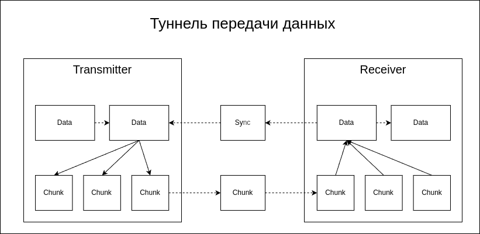
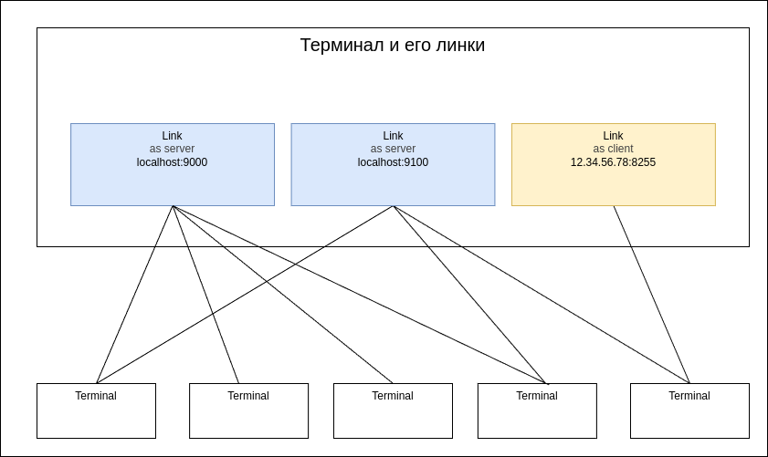

# shalink

## Testing

`shalink [options] [address]:port`

- -h - get help page
- -t - start transmitter (default as listening server)
- -r - start receiver (default as connecting client)
- -m - start mirror server (for external clients)
- -i - use invert mode (sender as client and receiver as server)
- -e - use external server
- -l msec - set latency, default 100
- -s size - set size of every packets, default 10000
- -c count - set count of packets, default 100
- -p msec - set pause between packets, default 10
- address:port - domain or ip address and port of UDP entry point, address can be empty

## Examples

Run transmitter and receiver on local port 9000 with default parameters. Testing on internal loop, five secunds about:

`shalink -t -r :9000`

Run transmitter as server on the localhost, port 9000. Other clients must be connecting to this port:

`shalink -t :9000`

Run receiver from host 12.34.56.78 port 9000:

`shalink -r 12.34.56.78:9000`

Run transmitter as a client that sends data to the server (invert mode):

`shalink -t -i 12.34.56.78:9000`

Run transmitter as server. It must to send 10 packets by 1000000 bytes with pause 200 msec between packets and latency 500 msec:

`shalink -t -s 1000000 -c 10 -p 200 -l 500 :9000`

Run mirror server, that moves streams between sender and receiver:

`shalink -m :9000`

Start transmitter and receiver over external mirror server:

`shalink -t -r -e 12.34.56.78:9000`

## Presentation

## ShaLink vs Srt

<table>

<tr>
<td>Свойство</td>
<td>Srt</td>
<td>ShaLink</td>
</tr>

<tr><td>Множественные подключения</td>
<td>Каждый канал SRT создаётся одной парой сокетов для соединения двух агентов протокола. Для передачи потока на несколько приёмников для каждого из них создаётся отдельый сокет со своей буферизацией</td>
<td>Если терминал передатчика создаётся с линком типа "сервер", то к нему может подключиться несколько получателей. Линк типа "клиент" может передавать только на один получатель.</td>
</tr>

<tr><td>Бондинг</td>
<td>Для бондинга используется с одной стороны один серверный сокет, на котором разрешены групповые подключения, а с другой объединённая группа клиентских сокетов</td>
<td>Специального режима бондинга нет. Терминал может использовать несколько линков, как серверных, так и клиентских, все они будут использоваться для передачи одного потока данных</td>
</tr>

<tr><td>Входной поток</td>
<td>Непрерывный поток байтов, приёмник и передатчик должны сами согласовывают структуру потока</td>
<td>Последовательность пакетов, на приёмнике появляются пакеты того же размера, что и отправленные. Это позволяет использовать ориентированные на прикладные данные фильтры, например, сжатие или различные сигналы.</td>
</tr>

<tr><td>Задержка</td>
<td>Основной параметр, управляющий задержкой - лейтенси. Фактическая задержка будет примерно равна лейтенси плюс время передачи по сетевому каналу. Задержка не зависит от качества канала, но при больших потерях механизм повтора передачи перестанет справляться и начнутся потери (пропуски) данных.</td>
<td>Основной параметр, определяющий задержку - время передачи по сетевому каналу. Лейтенси задаёт не стандартную. а максимальную задержку. При отсутствии потерь задержка равна задержке канала, при появлении потерь задержка будет возрастать, так как появляются повторы передачи. Максимальная задержка также будет примерно равна лейтенси плюс задержка канала, при этом начинаются реальные пропуски данных на приёмнике.</td>
</tr>

<tr><td>Приоритет данных</td>
<td>Лейтенси задаётся для всего канала и не может быть изменён. Для потоков mpeg-ts наибольшему риску подвергаются большие ключевые кадры, а их потеря делает бесполезным весь поток до следующего ключевого кадра.</td>
<td>Лейтенси может быть задан для каждого пакета отдельно. Это позволяет сохранить наиболее важные данные, например, ключевые кадры. Тогда при некоторых настройках может так случиться, что в потоке останутся только ключевые кадры, но поток останется наблюдаемым.</td>
</tr>

</table>
